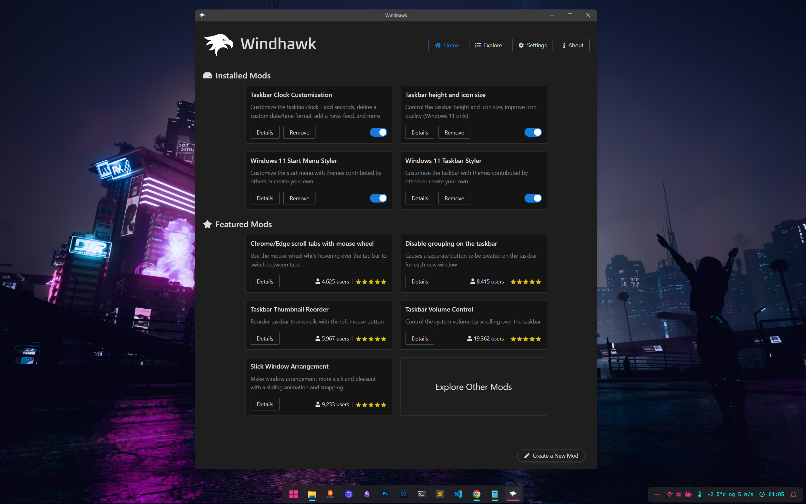

# WindhawkTheme
My Windhawk settings

Since quite few people asked me for the settings for my Windhark theme I made this gudie if anybody else was interested so I dont have to paste it over and over again to each user :)

So you want to start with the Docklike theme, cause mine is just a modded version of that theme. 

So first off you are going to need Windhawk, download at [Windhawk.net](https://windhawk.net/)

Then you need 3 plugins :

  - Windows 11 Taskbar Styler
  - Taskbar Clock Customization
  - Taskbar height and icon size

You can find more info on modding and themes in the [Windhawk Wiki](https://github.com/ramensoftware/windhawk/wiki)

#And here are my settings for each one : 

##For Windows 11 Taskbar Styler 

As I am using a png for my startmenu button , you need to change the path ImageSource=\"C:\\icons\\window.png\" to where you store your image

`{
  "theme": "DockLike",
  "controlStyles[0].target": "Taskbar.TaskbarFrame#TaskbarFrame > Grid#RootGrid",
  "controlStyles[0].styles[0]": "Margin=0,1,0,3",
  "resourceVariables[0].variableKey": "",
  "resourceVariables[0].value": "",
  "controlStyles[0].styles[1]": "CornerRadius=8",
  "controlStyles[1].target": "Windows.UI.Xaml.Controls.Grid#SystemTrayFrameGrid",
  "controlStyles[2].target": "Windows.UI.Xaml.Controls.TextBlock#InnerTextBlock[Text=]",
  "controlStyles[2].styles[0]": "Text=",
  "controlStyles[2].styles[1]": "Foreground=#f13a96",
  "controlStyles[3].target": "Windows.UI.Xaml.Controls.ContentPresenter",
  "controlStyles[3].styles[0]": "Foreground=#f13a96",
  "controlStyles[1].styles[0]": "Padding=8,0,8,0",
  "controlStyles[1].styles[1]": "CornerRadius=17",
  "controlStyles[4].target": "SystemTray.IconView#SystemTrayIcon",
  "controlStyles[4].styles[0]": "Foreground=#f13a96",
  "controlStyles[5].target": "Taskbar.ExperienceToggleButton#LaunchListButton[AutomationProperties.AutomationId=StartButton] > Taskbar.TaskListButtonPanel > Border#BackgroundElement",
  "controlStyles[5].styles[0]": "Background:=<ImageBrush Stretch=\"Uniform\" ImageSource=\"C:\\icons\\windows.png\" />",
  "controlStyles[6].styles[0]": "Visibility=Collapsed",
  "controlStyles[6].target": "Taskbar.ExperienceToggleButton#LaunchListButton[AutomationProperties.AutomationId=StartButton] > Taskbar.TaskListButtonPanel > Microsoft.UI.Xaml.Controls.AnimatedVisualPlayer#Icon",
  "controlStyles[5].styles[1]": "Height=24",
  "controlStyles[7].target": "Taskbar.TaskListLabeledButtonPanel@RunningIndicatorStates > Rectangle#RunningIndicator",
  "controlStyles[7].styles[0]": "Fill=#09fefd",
  "controlStyles[7].styles[1]": "Width=16",
  "controlStyles[7].styles[2]": "Fill@ActiveRunningIndicator=#f13a96",
  "controlStyles[7].styles[3]": "Width@ActiveRunningIndicator=32",
  "controlStyles[7].styles[4]": "Fill@RequestingAttentionRunningIndicator=#ff4f42"
}
`

##For Taskbar Clock Customization

I use url's to the local weather service to fetch the weather info in XML format and display it, If you want you can skip that and delete those parts, or find a weather service for your city that offers you for fetch the weather info and then you need to modify the code accodingly

`{
  "ShowSeconds": 0,
  "TimeFormat": "HH':'mm",
  "DateFormat": "ddd dd MMM",
  "WeekdayFormat": "dddd",
  "TopLine": "%date% | %time%",
  "BottomLine": "  %web1_full%°c og %web2_full% m/s    %time%",
  "MiddleLine": "",
  "TooltipLine": "%web3_full%",
  "Width": 180,
  "Height": 60,
  "TextSpacing": 0,
  "WebContentsItems[0].Url": "https://urltoweatherservice.here/",
  "WebContentsItems[0].BlockStart": "<observations>",
  "WebContentsItems[0].Start": "<T>",
  "WebContentsItems[0].End": "</T>",
  "WebContentsItems[0].MaxLength": 28,
  "WebContentsUpdateInterval": 20,
  "TimeStyle.Visible": 0,
  "TimeStyle.TextColor": "",
  "TimeStyle.TextAlignment": "Center",
  "TimeStyle.FontSize": 0,
  "TimeStyle.FontFamily": "",
  "TimeStyle.FontWeight": "",
  "TimeStyle.FontStyle": "",
  "TimeStyle.FontStretch": "",
  "TimeStyle.CharacterSpacing": 0,
  "DateStyle.TextColor": "#09fefd",
  "DateStyle.TextAlignment": "Center",
  "DateStyle.FontSize": 13,
  "DateStyle.FontFamily": "JetBrainsMono NF",
  "DateStyle.FontWeight": "SemiLight",
  "DateStyle.FontStyle": "",
  "DateStyle.FontStretch": "",
  "DateStyle.CharacterSpacing": 0,
  "oldTaskbarOnWin11": 0,
  "WebContentsItems[1].Url": "https://urltoweatherservice.here/",
  "WebContentsItems[1].BlockStart": "<observations>",
  "WebContentsItems[1].Start": "<F>",
  "WebContentsItems[1].End": "</F>",
  "WebContentsItems[1].MaxLength": 6,
  "WebContentsItems[2].Url": "https://urltoweatherservice.here/",
  "WebContentsItems[2].BlockStart": "<texts>",
  "WebContentsItems[2].Start": "<content>",
  "WebContentsItems[2].End": "</content>",
  "WebContentsItems[2].MaxLength": 180
}
`

##For Taskbar height and icon size

`{"IconSize":20,"TaskbarHeight":48,"TaskbarButtonWidth":46}`
